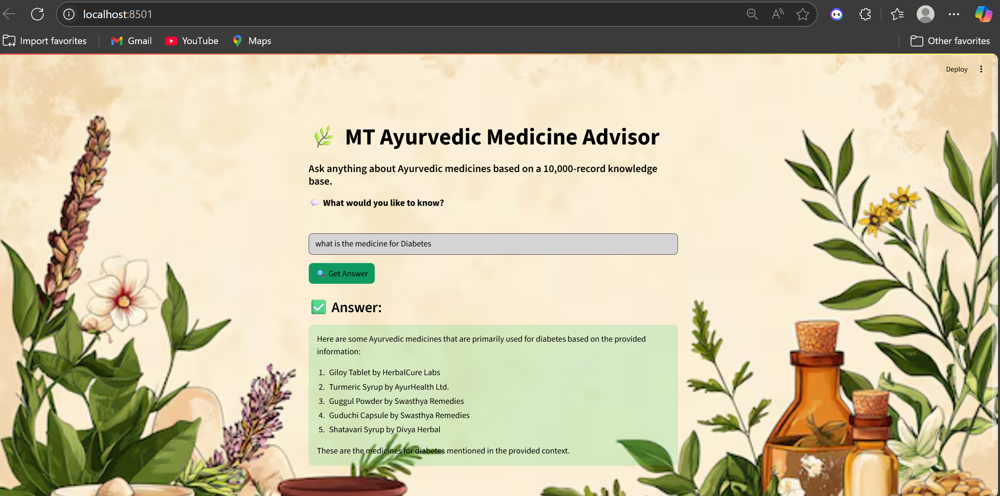

🌿🧪 MT Ayurvedic Advisor 🌱


A **Streamlit-powered web app** that allows users to query a knowledge base of **10,000 Ayurvedic medicine records** using **Retrieval-Augmented Generation (RAG)** with OpenAI.


---

## 🚀 Features

- Ask questions about Ayurvedic medicines.
- Uses LangChain with OpenAI’s embeddings and chat model.
- Background image UI with Streamlit.
- Vector store powered by **ChromaDB**.
- 10K-record Ayurvedic dataset support (CSV input).

---

## 🛠️ Setup Instructions
1.first run the vector_store.py
2.Then Run the streamlit run app.pys

### 1. Clone the Repository

```bash
git clone https://github.com/videesh890/Rag_Mini_project_on_Ayurvedic

```
### 🧩 Architecture

1. **Frontend**: `Streamlit` interface in `app.py`.
2. **Query Handler**: `rag_chain.py`:
   - Loads vector store.
   - Uses `RetrievalQA` chain from LangChain.
   - Connects to OpenAI’s `gpt-3.5-turbo`.
3. **Vector Creation**: `vector_store.py`:
   - Reads dataset.
   - Embeds records using `text-embedding-3-small`.
   - Saves as persistent ChromaDB index.

### 🔄 Workflow

1. User inputs a question in the Streamlit UI.
2. App calls `ask_medicine_bot()` → RAG chain retrieves relevant context from the vector DB.
3. Chat model returns a contextual answer.
4. Response is displayed.

### ⚠️ Error Handling

- Missing `.env` or API key aborts execution.
- On RAG failure, error is shown in Streamlit UI.

---
### 🌿✅ Output :



### video link :https://drive.google.com/file/d/1KA6EABXfbI8HFGxgZbKyPgRkdv2fZCDO/view?usp=sharing


